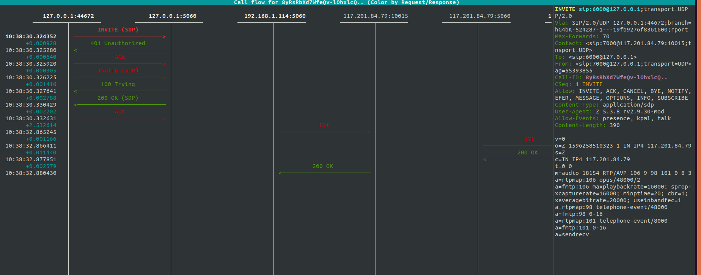
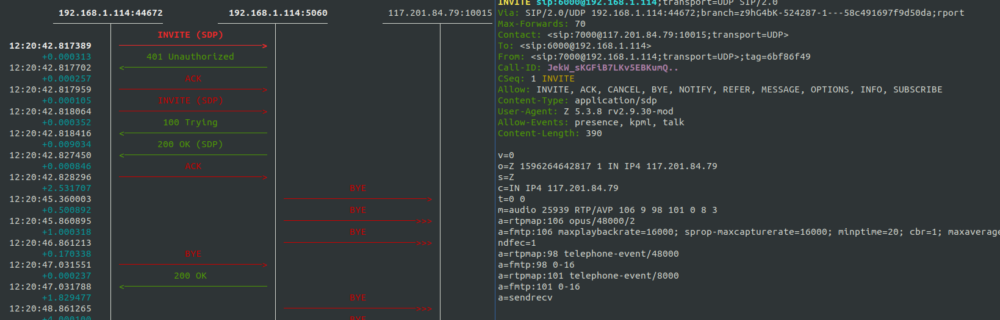

# Asterisk 

Asterix open-source telephony Server can be used to build multitude of applications . 

## Installation and setup 

check the asterisk available version  from https://downloads.asterisk.org/pub/telephony/asterisk/
use wget to download 

```commandline
wget https://downloads.asterisk.org/pub/telephony/asterisk/asterisk-17.6.0.tar.gz
tar -xvf asterisk-17.6.0.tar.gz
```

 libpri library allows Asterisk to communicate with ISDN connections.
 
 DAHDI ( Digium Asterisk Hardware Device Interface) library allows Asterisk to communicate with analog and digital telephones and telephone lines / PSTN
 
 dahdi-linux 
 ```commandline
wget https://downloads.asterisk.org/pub/telephony/dahdi-linux/dahdi-linux-current.tar.gz
tar -xvf dahdi-linux-current.tar.gz
```
dadhi-tools
```commandline
wget https://downloads.asterisk.org/pub/telephony/dahdi-tools/dahdi-tools-current.tar.gz 
tar -xvf dahdi-tools-current.tar.gz
``` 
 
Remember you make to make and install DAHDI and libpri before building asterisk 
 ```commandline
make
sudo make install 
make config 
```

## Build asterisk  
 
SIP stack ina Asterisk  
- chan_sip SIP channel driver ( old)
- chan_pjsip

Build with later using 
```commandline
cd asterisk-17.6.0
./configure --with-pjproject-bundled --with-jansson-bundled
```
output
```
config.status: creating makeopts
config.status: creating autoconfig.h
configure: Menuselect build configuration successfully completed

               .$$$$$$$$$$$$$$$=..      
            .$7$7..          .7$$7:.    
          .$$:.                 ,$7.7   
        .$7.     7$$$$           .$$77  
     ..$$.       $$$$$            .$$$7 
    ..7$   .?.   $$$$$   .?.       7$$$.
   $.$.   .$$$7. $$$$7 .7$$$.      .$$$.
 .777.   .$$$$$$77$$$77$$$$$7.      $$$,
 $$$~      .7$$$$$$$$$$$$$7.       .$$$.
.$$7          .7$$$$$$$7:          ?$$$.
$$$          ?7$$$$$$$$$$I        .$$$7 
$$$       .7$$$$$$$$$$$$$$$$      :$$$. 
$$$       $$$$$$7$$$$$$$$$$$$    .$$$.  
$$$        $$$   7$$$7  .$$$    .$$$.   
$$$$             $$$$7         .$$$.    
7$$$7            7$$$$        7$$$      
 $$$$$                        $$$       
  $$$$7.                       $$  (TM)     
   $$$$$$$.           .7$$$$$$  $$      
     $$$$$$$$$$$$7$$$$$$$$$.$$$$$$      
       $$$$$$$$$$$$$$$$.                

configure: Package configured for: 
configure: OS type  : linux-gnu
configure: Host CPU : x86_64
configure: build-cpu:vendor:os: x86_64 : pc : linux-gnu :
configure: host-cpu:vendor:os: x86_64 : pc : linux-gnu :
```
  
USe menu select option on Asterisk to install packages pick and choose application and other options such as music on hold , extra sound packages , PBX modules etc
```commandline
make menuselect
```  
output 
```commandline
 **************************************************
     Asterisk Module and Build Option Selection
 **************************************************

          Press 'h' for help.

      Add-ons (See README-addons.txt)
      Applications
      Bridging Modules
      Call Detail Recording
      Channel Event Logging
      Channel Drivers
      Codec Translators
      Format Interpreters
      Dialplan Functions
      PBX Modules
      Resource Modules
      Test Modules
      Compiler Flags
      Utilities
      AGI Samples
      Core Sound Packages
      Music On Hold File Packages
 ---> Extras Sound Packages
```

Compile asterisk on the system 
```commandline
make
```
output 
```commandline
Building Documentation For: third-party channels pbx apps codecs formats cdr cel bridges funcs tests main res addons 
 +--------- Asterisk Build Complete ---------+
 + Asterisk has successfully been built, and +
 + can be installed by running:              +
 +                                           +
 +                make install               +
 +-------------------------------------------+

```

Install 
```commandline
sudo make install
```
output
```commandline
done
 +---- Asterisk Installation Complete -------+
 +                                           +
 +    YOU MUST READ THE SECURITY DOCUMENT    +
 +                                           +
 + Asterisk has successfully been installed. +
 + If you would like to install the sample   +
 + configuration files (overwriting any      +
 + existing config files), run:              +
 +                                           +
 + For generic reference documentation:      +
 +    make samples                           +
 +                                           +
 + For a sample basic PBX:                   +
 +    make basic-pbx                         +
 +                                           +
 +                                           +
 +-----------------  or ---------------------+

```

Install samples 
```commandline
sudo make samples 
```

Run Asterisk
```commandline
➜  asterisk-17.6.0 sudo asterisk -c 
Asterisk 17.6.0, Copyright (C) 1999 - 2018, Digium, Inc. and others.
Created by Mark Spencer <markster@digium.com>
...
Asterisk Ready.
*CLI> 
```
ports uses 
````commandline
> ps -ef | grep asterisk

asterisk  28922 altanai    5u  IPv4 3449570      0t0  TCP localhost:38108->localhost:postgresql (CLOSE_WAIT)
asterisk  28922 altanai    9u  IPv4 3451466      0t0  UDP *:40388 
asterisk  28922 altanai   10u  IPv6 3451467      0t0  UDP *:52092 
asterisk  28922 altanai   12u  IPv4 3449574      0t0  UDP *:2727 
asterisk  28922 altanai   14u  IPv4 3449575      0t0  UDP *:iax 
asterisk  28922 altanai   15u  IPv4 3451995      0t0  TCP *:cisco-sccp (LISTEN)
asterisk  28922 altanai   18u  IPv4 3449577      0t0  UDP *:5000 
asterisk  28922 altanai   19u  IPv4 3449578      0t0  UDP *:4520 

````

You can use safe_asterisk to enable auto restart after crash thus minimizing downtime. It also creates core dump file .

One can continue on the sandbox environment to run the modules I describe in this repo.

show version
```commandline
*CLI> core show version 
Asterisk 17.6.0 built by root @ altanai-Inspiron-15-5578 on a x86_64 running Linux on 2020-07-30 15:33:43 UTC
```

## configuration 

Listen address for SIP in sip.conf , Listen on

specific IPv4 address.      Example: bindaddr=192.0.2.1
specific IPv6 address.      Example: bindaddr=2001:db8::1
IPv4 wildcard.              Example: bindaddr=0.0.0.0
IPv4 and IPv6 wildcards.    Example: bindaddr=::

## Modules 

asterisk/modules support teh modular structure of Asterisk

## Resources 

Custom applications such as res_musiconhold.so

## Codecs and Formats 

convert media on disk and channel 

## Cli commands 

Interface with asterisk and issue commands

Other interface for asterisk control are AMI ( Asterisk AManger Interface) and AGI ( Asterisk Gateway Interface ) which operate on APIs like PHP , C++ , Java , Perl

Reload SIP
```commandline
*CLI> pjsip reload
[Jul 31 09:54:58] NOTICE[22399]: sorcery.c:1345 sorcery_object_load: Type 'system' is not reloadable, maintaining previous values
Module 'res_pjsip.so' reloaded successfully.
Module 'res_pjsip_authenticator_digest.so' reloaded successfully.
Module 'res_pjsip_endpoint_identifier_ip.so' reloaded successfully.
Module 'res_pjsip_mwi.so' reloaded successfully.
Module 'res_pjsip_notify.so' reloaded successfully.
Module 'res_pjsip_outbound_publish.so' reloaded successfully.
Module 'res_pjsip_publish_asterisk.so' reloaded successfully.
Module 'res_pjsip_outbound_registration.so' reloaded successfully.
```
Settings show 
```commandline
*CLI> core show settings

PBX Core settings
-----------------
  Version:                     17.6.0
  Build Options:               BUILD_NATIVE, OPTIONAL_API
  Maximum calls:               Not set
  Maximum open file handles:   1024
  Root console verbosity:      0
  Current console verbosity:   0
  Debug level:                 0
  Trace level:                 0
  Maximum load average:        0.000000
  Minimum free memory:         0 MB
  Startup time:                10:33:28
  Last reload time:            10:33:28
  System:                      Linux/4.15.0-62-generic built by root on x86_64 2020-07-30 15:33:43 UTC
  System name:                 
  Entity ID:                   7c:67:a2:eb:ff:a5
  PBX UUID:                    fc3a2e05-e800-47e7-aa27-36ad924f85e0
  Default language:            en
  Language prefix:             Enabled
  User name and group:         /
  Executable includes:         Disabled
  Transcode via SLIN:          Enabled
  Transmit silence during rec: Disabled
  Generic PLC:                 Enabled
  Generic PLC on equal codecs: Disabled
  Hide Msg Chan AMI events:    Disabled
  Min DTMF duration::          80
  Cache media frames:          Enabled
  RTP use dynamic payloads:    1
  RTP dynamic payload types:   35-63,96-127

* Subsystems
  -------------
  Manager (AMI):               Disabled
  Web Manager (AMI/HTTP):      Disabled
  Call data records:           Enabled
  Realtime Architecture (ARA): Disabled

* Directories
  -------------
  Configuration file:          /etc/asterisk/asterisk.conf
  Configuration directory:     /etc/asterisk
  Module directory:            /usr/lib/asterisk/modules
  Spool directory:             /var/spool/asterisk
  Log directory:               /var/log/asterisk
  Run/Sockets directory:       /var/run/asterisk
  PID file:                    /var/run/asterisk/asterisk.pid
  VarLib directory:            /var/lib/asterisk
  Data directory:              /var/lib/asterisk
  ASTDB:                       /var/lib/asterisk/astdb
  IAX2 Keys directory:         /var/lib/asterisk/keys
  AGI Scripts directory:       /var/lib/asterisk/agi-bin

```

channel types 
```commandline
*CLI> core show channeltypes
Type             Description                              Devicestate   Presencestate Indications   Transfer     
-------------    -------------                            ------------- ------------- ------------- -------------
Recorder         Bridge Media Recording Channel Driver    no            no            yes           no           
Announcer        Bridge Media Announcing Channel Driver   no            no            yes           no           
Phone            Standard Linux Telephony API Driver      no            no            yes           no           
Console          OSS Console Channel Driver               no            no            yes           no           
USTM             UNISTIM Channel Driver                   no            no            yes           no           
CBAnn            Conference Bridge Announcing Channel     no            no            yes           no           
CBRec            Conference Bridge Recording Channel      no            no            no            no           
PJSIP            PJSIP Channel Driver                     yes           no            yes           yes          
UnicastRTP       Unicast RTP Media Channel Driver         no            no            no            no           
MulticastRTP     Multicast RTP Paging Channel Driver      no            no            no            no           
Skinny           Skinny Client Control Protocol (Skinny)  yes           no            yes           no           
IAX2             Inter Asterisk eXchange Driver (Ver 2)   yes           no            yes           yes          
MGCP             Media Gateway Control Protocol (MGCP)    yes           no            yes           no           
Local            Local Proxy Channel Driver               yes           no            yes           no           
Surrogate        Surrogate channel used to pull channel f no            no            no            no           
----------
15 channel drivers registered.

```

Set verbosity level ( 0-4)
```commandline
*CLI> core set verbose 1
Console verbose was OFF and is now 1.
```

## Applications 
Custom application that can be built - Call Queue monitoring 

Add a dialplan in extensions 
```
[internal_users]
exten => 6000,1,Answer()
exten => 6000,2,Wait(1)
exten => 6000,2,Wait(1)
exten => 6000,3,Playback(hello-world)
exten => 6000,4,Hangup()
```
Reload and see the dialplan 
```commandline
altanai-Inspiron-15-5578*CLI> dialplan reload
Dialplan reloaded.
altanai-Inspiron-15-5578*CLI> dialplan show 
...
[ Context 'internal_users' created by 'pbx_config' ]
  '6000' =>         1. Answer()                                   [extensions.conf:866]
                    2. Wait(1)                                    [extensions.conf:867]
                    3. Playback(hello-world)                      [extensions.conf:868]
                    4. Hangup()                                   [extensions.conf:869]
```

During Call 
```commandline
*CLI>   == Setting global variable 'SIPDOMAIN' to '192.168.1.114'
  == Spawn extension (internal_users, 6000, 5) exited non-zero on 'PJSIP/7000-00000000'
```

Dial two Calls 

extensions.conf
```
exten => 6001,1,Dial(SIP/phone-2,20)
exten => 6001,2,Verbose("---------------- Forward to phone2  -------")
```
reload dialplan and validate that its taken effect 
```commandline
*CLI> dialplan show 6001@internal_users
[ Context 'internal_users' created by 'pbx_config' ]
  '6001' =>         1. Dial(SIP/phone-2,20)                       [extensions.conf:872]
                    2. Verbose("---------------- Forward to phone2  -------") [extensions.conf:873]

-= 1 extension (2 priorities) in 1 context. =-
```
Dial 6001 and see channels while call is active
```commandline
core show channels
Channel              Location             State   Application(Data)             
0 active channels
0 active calls
1 call processed
```

Note that the sounds for asterisk playback , background and various other applications are loaded in 
/var/lib/asterisk/sounds/en/

More core and extra sounds can be downloaded from https://www.asterisksounds.org/en/download in various other languages like german apnish italian etc
such as 
```commandline
wget https://www.asterisksounds.org/sites/asterisksounds.org/files/sounds/en/download/asterisk-sounds-extra-en-2.9.15.zip
```

## debugging 

**Issue1** Cannot find sip commands 
```commandline
altanai-Inspiron-15-5578*CLI> sip show peers
No such command 'sip show peers' (type 'core show help sip show' for other possible commands)
```
\
**solution** First check is module is installed 
```commandline
module show like chan_sip.so 
```
When module is installed 
```commandline
altanai-Inspiron-15-5578*CLI> module show like chan_sip.so
Module                         Description                              Use Count  Status      Support Level
chan_sip.so                    Session Initiation Protocol (SIP)        0         
1 modules loaded
```

when modules is not installed 
```commandline
altanai-Inspiron-15-5578*CLI> module show like chan_sip.so
Module                         Description                              Use Count  Status      Support Level
0 modules loaded
```

If module is not loaded Make sure Asterisk is configured to load the module via modules.conf
There may be a case that res_pjsip is loaded inplace of chan_sip
```
; Do not load chan_sip by default, it may conflict with res_pjsip.
noload => chan_sip.so
```
In that case chan_pjsip would be loaded 
```commandline
altanai-Inspiron-15-5578*CLI> module show like chan_pjsip
Module                         Description                              Use Count  Status      Support Level
chan_pjsip.so                  PJSIP Channel Driver                     0          Running              core
1 modules loaded
```
On forcing loading of chan_sip module
```commandline
altanai-Inspiron-15-5578*CLI> module load chan_sip
Loaded chan_sip
SIP channel loading...
[Jul 31 13:25:30] WARNING[815]: chan_sip.c:35477 deprecation_notice: chan_sip has no official maintainer and is deprecated.  Migration to
[Jul 31 13:25:30] WARNING[815]: chan_sip.c:35478 deprecation_notice: chan_pjsip is recommended.  See guides at the Asterisk Wiki:
[Jul 31 13:25:30] WARNING[815]: chan_sip.c:35479 deprecation_notice: https://wiki.asterisk.org/wiki/display/AST/Migrating+from+chan_sip+to+res_pjsip
[Jul 31 13:25:30] WARNING[815]: chan_sip.c:35480 deprecation_notice: https://wiki.asterisk.org/wiki/display/AST/Configuring+res_pjsip

```

**Issue3** Unable to authenticate 
```commandline
*CLI> m[Aug  1 10:07:20] NOTICE[11076]: res_pjsip/pjsip_distributor.c:676 log_failed_request: Request 'REGISTER' from '<sip:phone-1@127.0.0.1>' failed for '127.0.0.1:56039' (callid: OgfL6JO~OO) - No matching endpoint found
[Aug  1 10:07:25] NOTICE[11076]: res_pjsip/pjsip_distributor.c:676 log_failed_request: Request 'INVITE' from '<sip:phone-1@127.0.0.1>' failed for '127.0.0.1:44672' (callid: c62tK1JzlDnDS9VFDGMQfg..) - No matching endpoint found
[Aug  1 10:07:25] NOTICE[11076]: res_pjsip/pjsip_distributor.c:676 log_failed_request: Request 'INVITE' from '<sip:phone-1@127.0.0.1>' failed for '127.0.0.1:44672' (callid: c62tK1JzlDnDS9VFDGMQfg..) - No matching endpoint found
[Aug  1 10:07:25] NOTICE[11076]: res_pjsip/pjsip_distributor.c:676 log_failed_request: Request 'INVITE' from '<sip:phone-1@127.0.0.1>' failed for '127.0.0.1:44672' (callid: c62tK1JzlDnDS9VFDGMQfg..) - Failed to authenticate
```
\
**solution** Define the extension context internal_users
extensions.conf
```
[internal_users]
exten => 6000,1,Answer()
exten => 6000,2,Wait(1)
exten => 6000,3,Playback(hello-world)
exten => 6000,4,Hangup()

```

and edit sip.conf or pjsip.conf and reload 

sip.conf
```
[7000]
    type=friend
    host=dynamic
    context=internal_users
    secret=1234
```

pjsip.conf
```
[7000]
 type=endpoint
 context=internal_users
 disallow=all
 allow=ulaw
 transport=transport-udp
 auth=7000
 aors=7000

[7000]
 type=auth
 auth_type=userpass
 password=1234
 username=7000

[7000]
 type=aor
 max_contacts=1

```
reload 
```commandline
sip reload 
pjsip reload
```

**Issue3** Unable to play hello world via playback
\
**solution** check if application is registered 
```commandline
core show application playback
```
If registered 
```commandline
  -= Info about application 'Playback' =- 

[Synopsis]
Play a file. 

[Description]
Plays back given filenames (do not put extension of wav/alaw etc). The playback
command answer the channel if no options are specified. If the file is
non-existant it will fail
This application sets the following channel variable upon completion:
${PLAYBACKSTATUS}: The status of the playback attempt as a text string.
    SUCCESS
    FAILED
See Also: Background (application) -- for playing sound files that are
interruptible
WaitExten (application) -- wait for digits from caller, optionally play music
on hold

[Syntax]
Playback(filename[&filename2[&...]][,options])

[Arguments]
options
    Comma separated list of options
    skip: Do not play if not answered

    noanswer: Playback without answering, otherwise the channel will be
    answered before the sound is played.
    NOTE: Not all channel types support playing messages while still on hook.


[See Also]
Background(), WaitExten(), ControlPlayback(), stream file, control stream file,
```

If not registered 
```commandline
altanai-Inspiron-15-5578*CLI> core show application playback
Your application(s) is (are) not registered
```


**Issue 4** Public / private address conflicts 

\
**solution** Change bidn addr from 0.0.0.0 to private IP and reload 


**Issue5** While working on IVR , WaitExtern , Background and DTMF applications you may find the prompt and press sounds missing 
```commandline
[Aug  2 08:55:44] WARNING[25971][C-0000002d]: file.c:1262 ast_streamfile: Unable to open are-you-still-there (format (ulaw)): No such file or directory
[Aug  2 08:55:44] WARNING[25971][C-0000002d]: app_playback.c:497 playback_exec: Playback failed on PJSIP/7000-0000002b for are-you-still-there
```
or 
```commandline
[Aug  2 08:54:52] WARNING[25971][C-0000002d]: file.c:789 ast_openstream_full: File press-1 does not exist in any format
[Aug  2 08:54:52] WARNING[25971][C-0000002d]: file.c:1262 ast_streamfile: Unable to open press-1 (format (ulaw)): No such file or directory
[Aug  2 08:54:52] WARNING[25971][C-0000002d]: pbx_builtins.c:1175 pbx_builtin_background: ast_streamfile failed on PJSIP/7000-0000002b for press-1&or&press-2
```
**solution** Download sound files or make your own prompts 