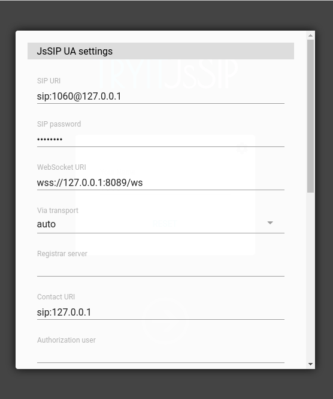
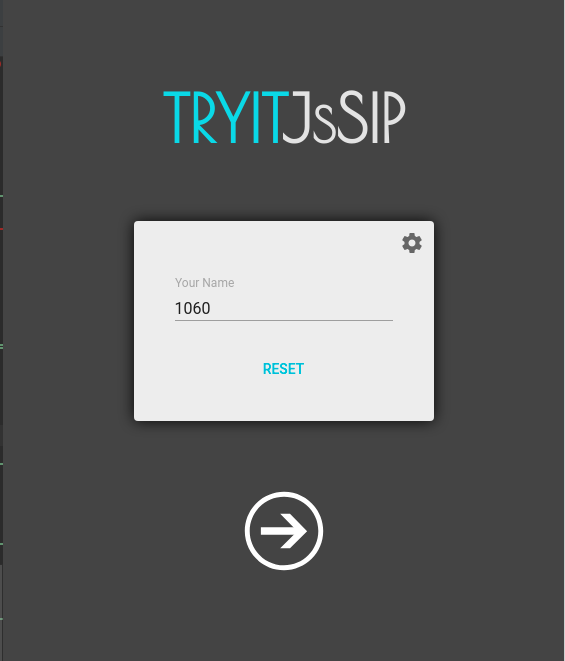
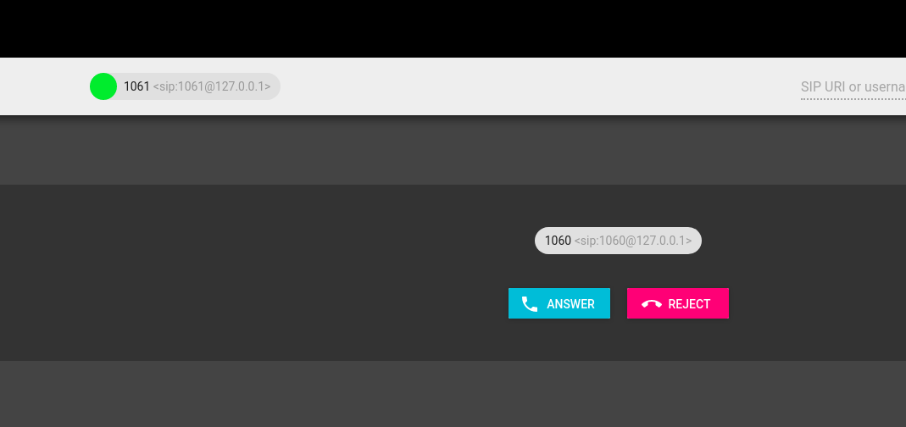
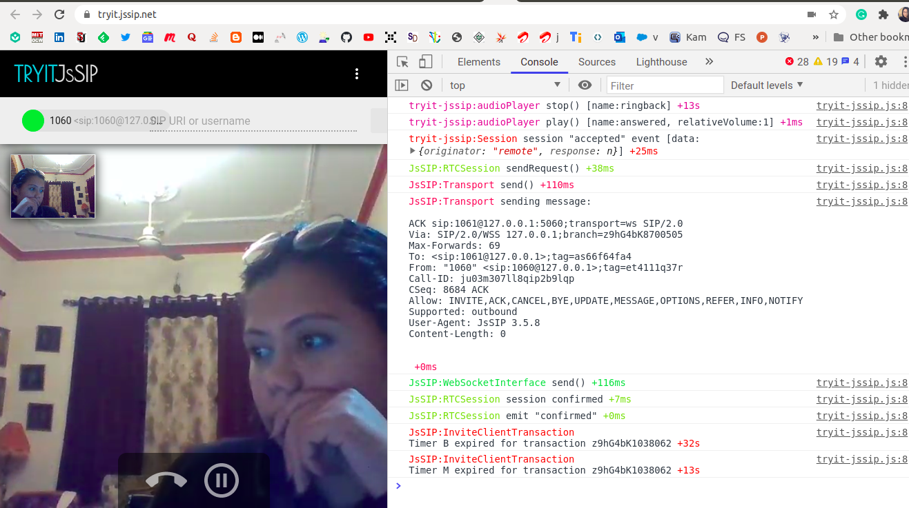
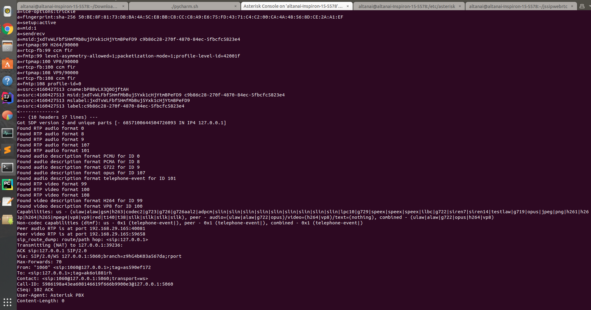
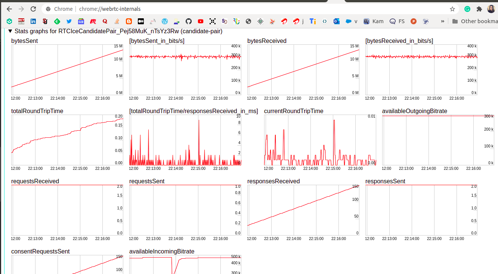

# Webrtc support for asterisk 

To connect video based webrtc endpoints ensure you load the codecs  and also libsrtp . 
Overwrite the selective conf in this folders with the existing conf of asterisk  to run a basic webrtc video call . 

These were tested with sipml5 on asterisk v17 with chan_sip. 

## Generating self-signed certs

use the "ast_tls_cert" script in the "contrib/scripts" Asterisk source directory to
make a self-signed certificate authority and an Asterisk certificate.
```
sh ast_tls_cert.sh -C localhost -O "altanai" -d .
```

after creating the self signed keys start the server 
```
asterisk -vvvvvvc
```

channels 
```
Peer             User/ANR         Call ID          Format           Hold     Last Message    Expiry     Peer      
10.10.10.10     1060             e8ae107f-ce90-2  (ulaw)           No       Rx: ACK                    1060 
```

## Codecs 

core show codecs
Disclaimer: this command is for informational purposes only.
	It does not indicate anything about your configuration.
      ID TYPE  NAME         FORMAT           DESCRIPTION
------------------------------------------------------------------------------------------------
      31 image png          png              (PNG Image)
       6 audio g726         g726             (G.726 RFC3551)
       4 audio alaw         alaw             (G.711 a-law)
       2 audio g723         g723             (G.723.1)
      20 audio speex        speex            (SpeeX)
      21 audio speex        speex16          (SpeeX 16khz)
      22 audio speex        speex32          (SpeeX 32khz)
      24 audio g722         g722             (G722)
      25 audio siren7       siren7           (ITU G.722.1 (Siren7, licensed from Polycom))
      32 video h261         h261             (H.261 video)
      33 video h263         h263             (H.263 video)
       8 audio adpcm        adpcm            (Dialogic ADPCM)
      36 video h265         h265             (H.265 video)
      44 audio silk         silk8            (SILK Codec (8 KHz))
      45 audio silk         silk12           (SILK Codec (12 KHz))
      46 audio silk         silk16           (SILK Codec (16 KHz))
      47 audio silk         silk24           (SILK Codec (24 KHz))
      28 audio g719         g719             (ITU G.719)
      34 video h263p        h263p            (H.263+ video)
      35 video h264         h264             (H.264 video)
      19 audio g729         g729             (G.729A)
       9 audio slin         slin             (16 bit Signed Linear PCM)
      10 audio slin         slin12           (16 bit Signed Linear PCM (12kHz))
      11 audio slin         slin16           (16 bit Signed Linear PCM (16kHz))
      12 audio slin         slin24           (16 bit Signed Linear PCM (24kHz))
      13 audio slin         slin32           (16 bit Signed Linear PCM (32kHz))
      14 audio slin         slin44           (16 bit Signed Linear PCM (44kHz))
      15 audio slin         slin48           (16 bit Signed Linear PCM (48kHz))
      16 audio slin         slin96           (16 bit Signed Linear PCM (96kHz))
      17 audio slin         slin192          (16 bit Signed Linear PCM (192kHz))
       3 audio ulaw         ulaw             (G.711 u-law)
      18 audio lpc10        lpc10            (LPC10)
      27 audio testlaw      testlaw          (G.711 test-law)
      43 audio none         none             (<Null> codec)
      42 image t38          t38              (T.38 UDPTL Fax)
      39 video vp9          vp9              (VP9 video)
      38 video vp8          vp8              (VP8 video)
       5 audio gsm          gsm              (GSM)
      37 video mpeg4        mpeg4            (MPEG4 video)
      23 audio ilbc         ilbc             (iLBC)
      40 text  red          red              (T.140 Realtime Text with redundancy)
      41 text  t140         t140             (Passthrough T.140 Realtime Text)
      29 audio opus         opus             (Opus Codec)
      30 image jpeg         jpeg             (JPEG image)
       7 audio g726aal2     g726aal2         (G.726 AAL2)
       1 audio codec2       codec2           (Codec 2)
      26 audio siren14      siren14          (ITU G.722.1 Annex C, (Siren14, licensed from Polycom))


## Webrtc clients 

generate a client certificate for our SIP device.
```
./ast_tls_cert -m client -c ca.crt -k ca.key -C localhost -O "altanai" -d . -o malcolm
```

### Registeration of JSSIP with Asterisk





### Making and receiving WebRTC calls





### console 



### chome webrtc-internals 




## Debugging 

setting debugger on a peer 
````shell script
SIP SET DEBUG PEER 1061
````

**Issue1**  Transport error
```
] ERROR[15167][C-00000014]: chan_sip.c:4344 __sip_reliable_xmit: Serious Network Trouble; __sip_xmit returns error for pkt data
...
 0x7f668c008430 -- Strict RTP learning after ICE completion
...
 Auto fallthrough, channel 'SIP/1060-0000002c' status is 'CONGESTION'
```
\
**solution** Remove ICE support 


**Issue2** Module mistmatch between chan_sip and re_pjsip
\
**solution** Although chan_sip is depriciated but if you are using later versions of asterisk it may automatically already eb loading pjsip .
To disable this you can use asterisk_cli to unload res_pjsip
```shell script
noload => res_pjsip.so
noload => res_pjsip_pubsub.so
noload => res_pjsip_session.so
noload => chan_pjsip.so
noload => res_pjsip_exten_state.so
noload => res_pjsip_log_forwarder.so
```

**Issue3** No RTP engine was found. Do you have one loaded? on Asterisk 17.6.0  Linux x86_64
```shell script

Found peer '1060' for '1060' from 127.0.0.1:41386
[Oct 29 15:32:59] ERROR[10375][C-00000002]: rtp_engine.c:489 ast_rtp_instance_new: No RTP engine was found. Do you have one loaded?
[Oct 29 15:32:59] NOTICE[10375][C-00000002]: chan_sip.c:19680 send_check_user_failure_response: RTP init failure for device "1060" <sip:1060@127.0.0.1>;tag=c2ukemc9jf for INVITE, code = -9

<--- Reliably Transmitting (no NAT) to 127.0.0.1:5060 --->
SIP/2.0 503 Service Unavailable
Via: SIP/2.0/WSS agughe5cmo73.invalid;branch=z9hG4bK4811407;received=127.0.0.1
From: "1060" <sip:1060@127.0.0.1>;tag=c2ukemc9jf
To: <sip:1061@127.0.0.1>;tag=as4964acae
Call-ID: 2pnpo3cd1rkbucdva75m
CSeq: 7410 INVITE
Server: Asterisk PBX
Allow: INVITE, ACK, CANCEL, OPTIONS, BYE, REFER, SUBSCRIBE, NOTIFY, INFO, PUBLISH, MESSAGE
Supported: replaces, timer
Reason: Q.850;cause=34
Content-Length: 0
```
\
**solution** see the module loaded for rtp 
```shell script
> module show like res_rtp
Module                         Description                              Use Count  Status      Support Level
0 modules loaded
```
If no module are founf then load modules for  res_rtp_asterisk and res_rtp_multicast.
```shell script
module load res_rtp_asterisk
module load res_rtp_multicast

> module show like res_rtp
Module                         Description                              Use Count  Status      Support Level
res_rtp_asterisk.so            Asterisk RTP Stack                       0          Running              core
res_rtp_multicast.so           Multicast RTP Engine                     0          Running              core
2 modules loaded
```

**Issue4** No SRTP module loaded, can't setup SRTP session.
```shell script 
[Oct 29 15:40:05] ERROR[10748][C-00000001]: chan_sip.c:6012 dialog_initialize_dtls_srtp: No SRTP module loaded, can't setup SRTP session.
[Oct 29 15:40:05] NOTICE[10748][C-00000001]: chan_sip.c:19680 send_check_user_failure_response: RTP init failure for device "1060" <sip:1060@127.0.0.1>;tag=gkqno51k23 for INVITE, code = -9
```
\
**Solution** check for srtp module 
```shell script
>module show like srtp
Module                         Description                              Use Count  Status      Support Level
0 modules loaded
*CLI> 
```
If none is found load srtp module 
```shell script
> module load res_srtp.so

*CLI> module show like srtp
Module                         Description                              Use Count  Status      Support Level
res_srtp.so                    Secure RTP (SRTP)                        0          Running              core
1 modules loaded
```

**Issue5** 
```shell script
Scheduling destruction of SIP dialog '630a75140ec65e2e3893478a3d816012@127.0.0.1:5064' in 32000 ms (Method: INVITE)
    -- SIP/1061-00000003 is circuit-busy
Scheduling destruction of SIP dialog '630a75140ec65e2e3893478a3d816012@127.0.0.1:5064' in 32000 ms (Method: INVITE)
  == Everyone is busy/congested at this time (1:0/1/0)
    -- Executing [1061@public:5] Hangup("SIP/1060-00000002", "") in new stack
  == Spawn extension (public, 1061, 5) exited non-zero on 'SIP/1060-00000002'
Scheduling destruction of SIP dialog '2pnpovgm6b3um4nbu6sb' in 32000 ms (Method: INVITE)

<--- Reliably Transmitting (no NAT) to 127.0.0.1:5060 --->
SIP/2.0 603 Declined
Via: SIP/2.0/WSS agughe5cmo73.invalid;branch=z9hG4bK3562038;received=127.0.0.1
From: "1060" <sip:1060@127.0.0.1>;tag=ul6sh9iirq
To: <sip:1061@127.0.0.1>;tag=as45129f0a
Call-ID: 2pnpovgm6b3um4nbu6sb
CSeq: 3053 INVITE
Server: Asterisk PBX
Allow: INVITE, ACK, CANCEL, OPTIONS, BYE, REFER, SUBSCRIBE, NOTIFY, INFO, PUBLISH, MESSAGE
Supported: replaces, timer
Reason: Q.850;cause=16
Content-Length: 0
```

**Issue6** Opus not loaded 
```shell script
'codec_opus.so': /usr/lib/asterisk/modules/codec_opus.so: cannot open shared object file: No such file or directory
```
\
**solution** Look for all available codecs and Install andy codec that may be missing


**Issue7**488 Not acceptable Here due to rtcpMuxPolicy
```shell script
] The rtcpMuxPolicy option is being considered for removal and may be removed no earlier than M62, around October 2017. If you depend on it, please see https://www.chromestatus.com/features/5654810086866944 for more details.
```
\
**solution** chrome states that - When the policy is "negotiate", the ICE candidates for both RTP and RTCP will be gathered. If the remote-endpoint is capable of multiplexing RTCP, multiplex RTCP on the RTP candidates. If it is not, use both the RTP and RTCP candidates separately.
Therefore now Webrtc supports negotiated as mux policy 

**Issue8** ICE issues with JSSIP
```shell script
emit "peerconnection:setremotedescriptionfailed" [error:DOMException: Failed to execute 'setRemoteDescription' on 'RTCPeerConnection': Failed to set remote offer sdp: Called with SDP without ice-ufrag and ice-pwd.]
```